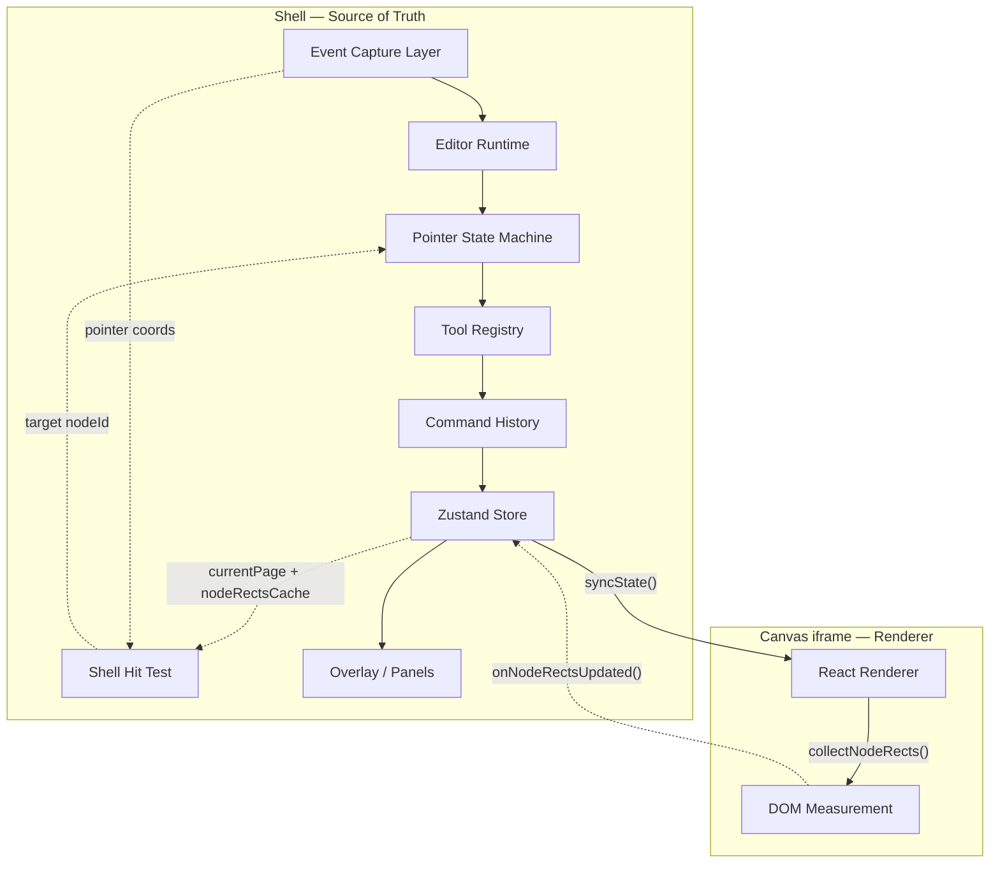
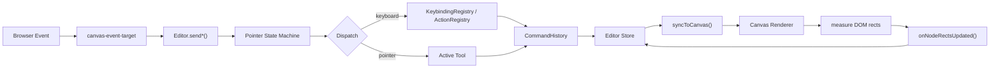
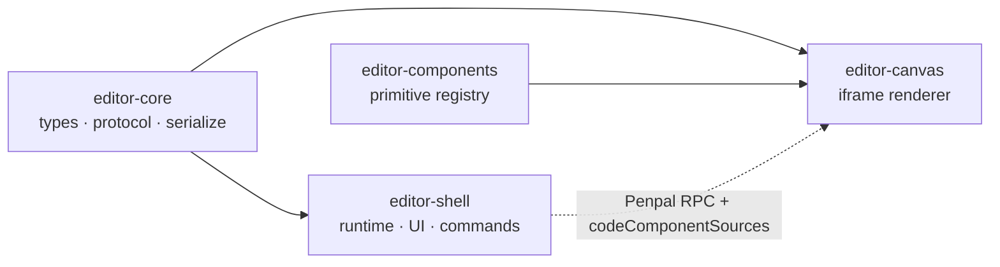

# Design Editor Engine

DOM/React 기반 비주얼 에디터 엔진. 에디터에서 보이는 것이 곧 React 코드가 된다.

`~7,000 LOC` · `4 packages` · `TypeScript strict`

> **[Live Demo](https://design-editor-shell.pages.dev)**

<!-- TODO: 스크린샷 추가 -->
<!--  -->

---

## 아키텍처

Shell(상태·이벤트·UI)과 Canvas(렌더링)를 **iframe으로 분리**하여 CSS/JS를 격리한다. Shell이 편집 상태와 입력을 소유하고, Canvas는 동기화된 상태를 렌더링한 뒤 측정한 geometry를 다시 Shell에 보고한다.



**원칙**

- Shell의 Zustand store가 source of truth다.
- Canvas는 편집 상태를 소유하지 않고, 동기화된 상태를 렌더링한다.
- 주 hit test는 Shell이 `currentPage + nodeRectsCache`로 수행한다.
- Canvas는 geometry 측정과 렌더링 결과 보고에 집중한다.

---

## 이벤트 파이프라인

브라우저 이벤트는 Shell에서 해석되고, 그 결과만 Canvas에 반영된다.



---

## 설계 패턴

| 패턴                 | 위치                            | 역할                                                                                                  |
| -------------------- | ------------------------------- | ----------------------------------------------------------------------------------------------------- |
| **Composition Root** | `App.tsx`, `services/Editor.ts` | `App`이 단일 `Editor` 런타임 객체를 만들고 iframe RPC를 조립                                          |
| **Command + Merge**  | `commands/`                     | 모든 상태 변경을 Command로 실행. Undo/Redo 지원. `MergableCommand`로 연속 리사이즈를 단일 Undo로 병합 |
| **Strategy**         | `tools/`                        | 활성 도구(Select / Frame / Text)에 따라 동일 포인터 이벤트를 다르게 처리                              |
| **State Machine**    | `interaction/`                  | 제스처(클릭/드래그/리사이즈/휠)를 상태 기반으로 분기                                                  |
| **Bridge**           | `services/`                     | `CanvasBridge`가 iframe RPC를 추상화. Shell이 iframe을 직접 접근하지 않음                             |
| **Receiver**         | `commands/`                     | Command가 Store에 직접 의존하지 않고 `EditorReceiver` 인터페이스를 통해 실행                          |

---

## 패키지 구조



```
EditorStore
├── document: DocumentNode
├── codeComponents: CodeComponentDefinition[]
├── selection / hoveredId / activeTool
├── zoom / pan
└── nodeRectsCache / dragPreview
```

```
DocumentNode → PageNode → SceneNode
                            ├── ElementNode     (HTML element)
                            ├── InstanceNode    (code component instance)
                            └── TextNode        (rich text)
```

---

## 기술 스택

| Category | Stack                                                   |
| -------- | ------------------------------------------------------- |
| UI       | React 18, Monaco, Tiptap                                |
| State    | Zustand + Immer, XState v5                              |
| IPC      | Penpal (postMessage RPC)                                |
| Codegen  | `serializeNode()` / `serializeDocument()`, esbuild-wasm |
| Build    | Vite, pnpm monorepo                                     |
| Quality  | TypeScript strict, ESLint, Prettier, Playwright         |
| Deploy   | Cloudflare Pages                                        |

---

## 시작하기

```bash
pnpm install

# Dev server (Shell :3000 + Canvas :3001)
pnpm dev

# Build
pnpm build

# Quality check
pnpm type-check
pnpm lint
pnpm test:unit
pnpm test:e2e
```
