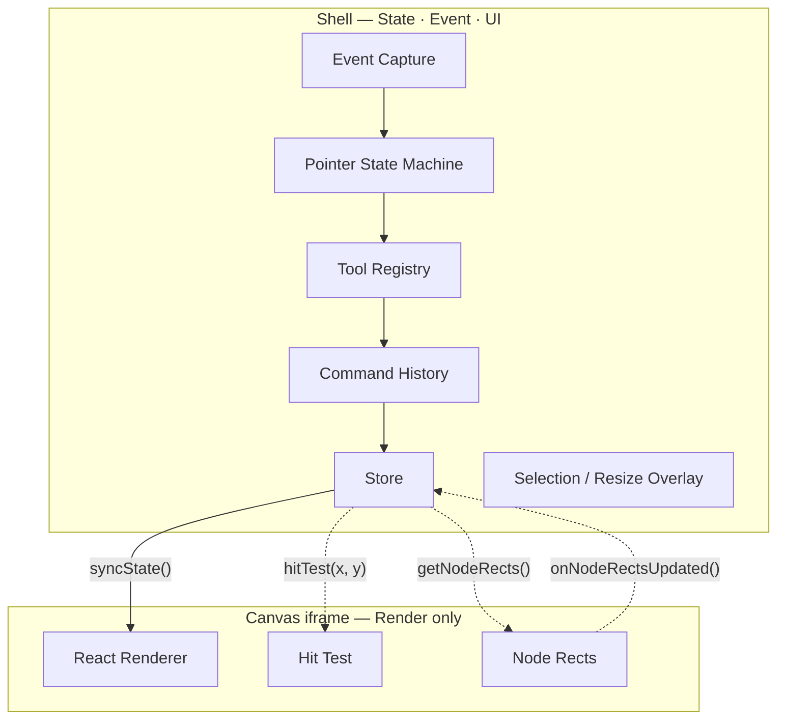
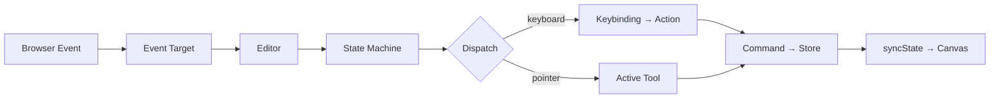
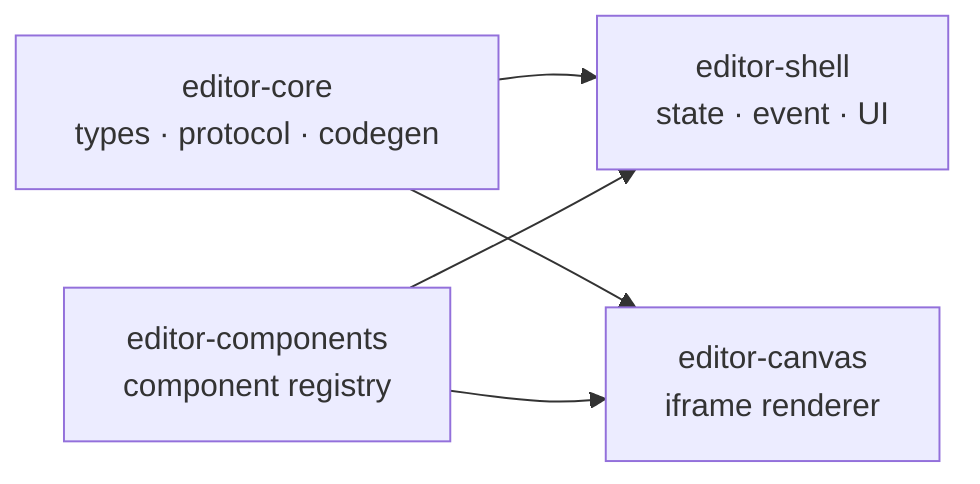

# Design Editor Engine

DOM/React 기반 비주얼 에디터 엔진. 에디터에서 보이는 것이 곧 React 코드가 된다.

`~7,000 LOC` · `4 packages` · `TypeScript strict`

> **[Live Demo](https://design-editor-shell.pages.dev)**

<!-- TODO: 스크린샷 추가 -->
<!--  -->

---

## 아키텍처

Shell(상태·이벤트·UI)과 Canvas(렌더링)를 **iframe으로 분리**하여 CSS/JS를 격리한다. Canvas는 순수 렌더러로, 이벤트를 수신하지 않고 Shell의 RPC 요청에만 응답한다.



**원칙**: Canvas는 상태를 변경하지 않는다. Shell이 상태를 갱신한 뒤 `syncState()`로 푸시하는 **단방향 데이터 흐름**.

---

## 이벤트 파이프라인

브라우저 이벤트가 7개 레이어를 거쳐 Canvas에 반영된다.



---

## 설계 패턴

| 패턴                | 위치           | 역할                                                                                                  |
| ------------------- | -------------- | ----------------------------------------------------------------------------------------------------- |
| **Command + Merge** | `commands/`    | 모든 상태 변경을 Command로 실행. Undo/Redo 지원. `MergableCommand`로 연속 리사이즈를 단일 Undo로 병합 |
| **Strategy**        | `tools/`       | 활성 도구(Select / Frame / Text)에 따라 동일 포인터 이벤트를 다르게 처리                              |
| **State Machine**   | `interaction/` | 비동기 hitTest와 제스처(클릭/드래그/리사이즈)를 상태 기반으로 분기                                    |
| **Bridge**          | `services/`    | `CanvasBridge`가 iframe RPC를 추상화. Shell이 iframe을 직접 접근하지 않음                             |
| **Receiver**        | `commands/`    | Command가 Store에 직접 의존하지 않고 `EditorReceiver` 인터페이스를 통해 실행                          |

---

## 패키지 구조



```
DocumentNode → PageNode → SceneNode
                            ├── ElementNode     (HTML element)
                            ├── InstanceNode    (component instance)
                            └── TextNode        (rich text)
```

---

## 기술 스택

| Category | Stack                                           |
| -------- | ----------------------------------------------- |
| UI       | React 18, Tiptap                                |
| State    | Zustand + Immer, XState v5                      |
| IPC      | Penpal (postMessage RPC)                        |
| Codegen  | esbuild-wasm                                    |
| Build    | Vite, pnpm monorepo                             |
| Quality  | TypeScript strict, ESLint, Prettier, Playwright |
| Deploy   | Cloudflare Pages                                |

---

## 시작하기

```bash
pnpm install

# Dev server (Shell :3000 + Canvas :3001)
cd packages/editor-shell && pnpm dev
cd packages/editor-canvas && pnpm dev

# Quality check
pnpm type-check && pnpm lint && pnpm format
```
